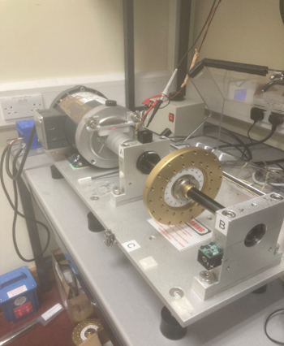
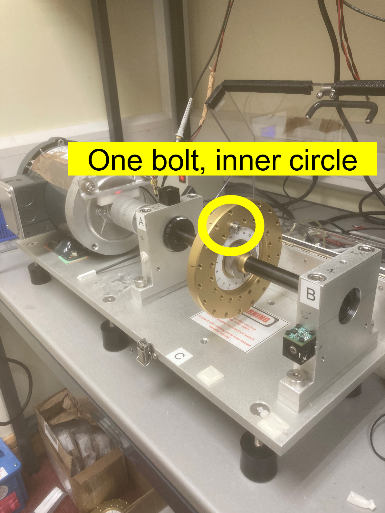
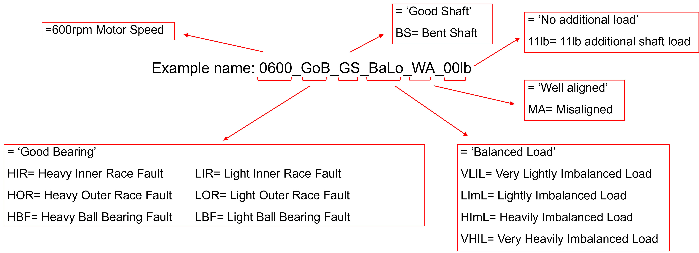

# Motor Fault Sample Dataset

## Sample Dataset Information

### Raw Data Properties

Sample motor data is collected using a SpectraQuest Machinery Fault Simulator. The setup looks as follows:

Faults tested include a variety of mechanical faults as follows:

- Very Light Imbalance
- Light Imbalance
- Heavy Imbalance
- Very Heavy Imbalance
- Bent Shaft
- Misaligned Shaft (Angular)
- Light Inner Race Fault
- Heavy Inner Race Fault
- Light Outer Race Fault
- Heavy Outer Race Fault
- Light Ball Bearing Fault
- Heavy Ball Bearing Fault

For imbalance faults, varying loads are applied in the setup, a sample can be seen here:

Details for other fault types:

Each fault was tested at 600, 1200, 1800, 2400 and 3000 RPM and tested both with and without an additional 11 lb (5 kg) load on the shaft. ADXL356 sensor data is used for vibration raw data.

For the ADXL356 sensor, the sampling frequency was **20 kHz** and data csv files recorded for **2 seconds** in the X, Y and Z directions.

Data files are saved in `.csv` format with the following naming convention:

